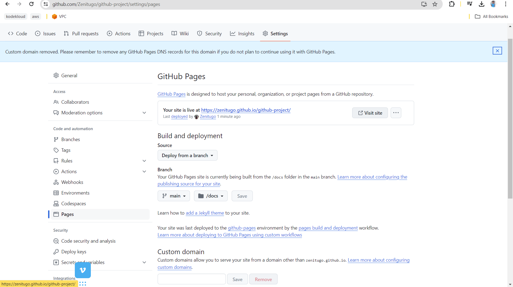

# CAREER ESSENTIALS IN GITHUB PROFESSIONAL CERTIFICATE.

## GITHUB PAGES
GitHub pages can be used to host static websites. To understand this concept better, I used got a free templates from
(https://www.free-css.com/free-css-templates)

**Steps to host a website on GitHub Pages**
- Go to your repo on github
- click on settings
- on the left panel, click pages
- Under the build and deployment section, select deploy from branch
- Under the branch section, select the branch you have your repo on, choose your folder and click save.
- wait for it to get built and display the url of the website

This is an image of the configuration

This is an image of the website deployed with githubpages

It first displays the readme in the repo when it is deployed

To see the website deployed on the browser add the path to your html files

**NOte:**  Github pages makes use of Github actions to build and deploy.
Pictoral representation of github actions buildin and deploying

## PYTHON WITH GITHUB CODESPACES

Python script was created
**Podcastfeeds:** (https://podcastfeeds.nbcnews.com/RPWEjhKq)